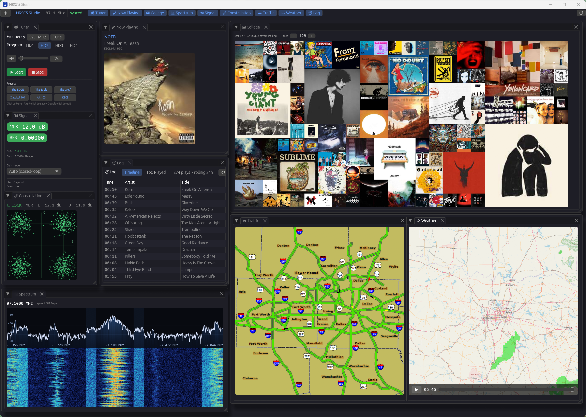
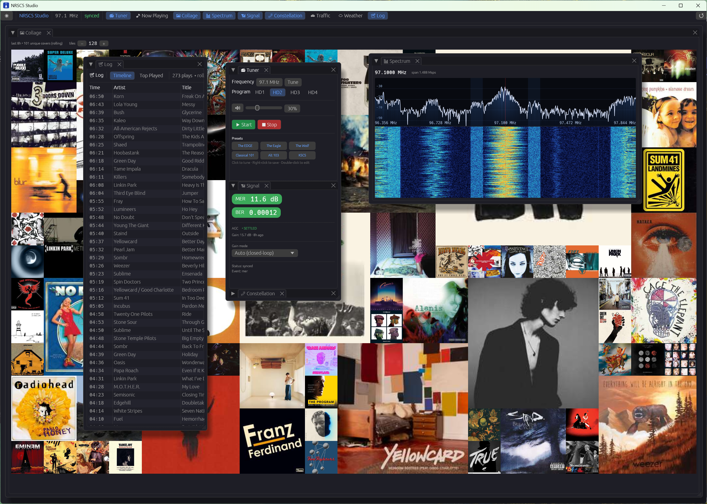

# NRSC5 Studio

A native Windows desktop app for listening to **HD Radio** broadcasts with an RTL-SDR dongle. Built in Rust with [egui](https://www.egui.rs/), wrapped around the excellent [`nrsc5`](https://github.com/theori-io/nrsc5) HD Radio decoder.

NRSC5 Studio gives you everything `nrsc5.exe` already does — tuning, demodulating, decoding HD1–HD4 subchannels, pulling album art and station logos — and adds a polished, persistent GUI on top, with a few extras the command line never had.

> **Status:** pre-release polish. Functional and stable on Windows 10/11 x64. Linux/macOS aren't supported yet (the Windows-specific per-app volume control would need replacing).

---

## Screenshots



*The default dock layout — Tuner, Now-Playing, Spectrum, Constellation, Traffic, Weather, and the rolling Album-Art Collage all visible at once.*



*The egui-based dock is fully configurable: drag tabs into floating panes, close the ones you don't need, and feature the ones you do. Here the album-art collage takes center stage on a station that doesn't broadcast traffic or weather.*

---

## Features

- **Full HD Radio playback** — HD1/HD2/HD3/HD4 subchannel selection, automatic retune on frequency change, persistent presets you can save, recall, rename, and re-target via a double-click edit dialog.
- **Now-Playing pane** — title / artist / album / genre from broadcast metadata, plus cover art and the station logo if the station you are listening to transmits it.
- **Album-Art Collage** — a rolling 8-hour squarified-treemap heat-map of every unique cover seen on the station. Frequent plays grow into bigger tiles; the layout re-flows as new art comes in. **Survives restarts** — covers are cached to `%LOCALAPPDATA%\nrsc5-studio\art-cache\` so the heat-map repopulates instantly on relaunch (within the 8-hour window).
- **24-Hour Song Log** — every play the station broadcasts metadata for is captured with a timestamp and persisted across restarts. Two views: a **Timeline** of the most recent plays and a **Top Played** grouping by `(title, artist)`. Export to RFC-4180 CSV for the scrobbler crowd. Aggressive filtering keeps station IDs, slogans, and call signs out of the log.
- **Spectrum + Waterfall** — a dedicated SDR scope tab with a 1024-bin live FFT trace (SDR#-style translucent gradient fill, ±20 dB grid, faint shading at the HD digital sidebands at ±129–199 kHz) and a 256-row scrolling waterfall underneath with a turbo colormap. Driven from a tap on the same I/Q stream that feeds the decoder, so what you see is what nrsc5 sees.
- **QPSK Constellation** — a phosphor-green scope showing the OFDM-subcarrier constellation cloud, with cloud spread driven by live MER per sideband. Watch the cloud tighten as signal quality improves — especially satisfying while the AGC walks into its sweet spot.
- **Closed-Loop AGC** — a host-side automatic-gain-control loop (separate from the dongle's built-in AGC) that walks the R820T2 gain table to find the setting that maximizes per-sideband MER for whatever signal you're tuned to. Switch between **Auto** / **Manual** / **Hardware AGC** in the Signal panel; choice persists between runs.
- **Traffic Map** — TPEG traffic-tile decode, stitched into a single map image the moment all tiles for an area arrive. Only IHeartMedia stations transmit this. [IHeartMedia Stations](https://www.iheartmedia.com/stations)
- **Weather Radar Animation** — every weather overlay frame from the broadcast is captured with its real wall-clock timestamp. Play / pause / scrub through up to 90 minutes of frames with a rocker slider; duplicate frames are deduplicated by content hash so the loop only advances when the station actually pushes new radar. Only IHeartMedia stations transmit this. [IHeartMedia Stations](https://www.iheartmedia.com/stations)
- **Signal Quality** — live MER (lower / upper sidebands), BER counters, and the current AGC gain in dB with a status badge (probing / settled / bailed) and time-since-last-change.
- **Per-app Volume** — Windows COM-based per-process volume / mute, so NRSC5 Studio's volume slider only changes NRSC5 Studio's audio (not the whole system).
- **Friendly first-run experience** — if no RTL-SDR is plugged in, a centered "Plug in an RTL-SDR and press Refresh" overlay replaces the cryptic empty state. The overlay auto-dismisses the moment a dongle is detected.
- **Persistent dock layout** — drag tabs into floating sub-panes, split horizontally or vertically. Your layout is restored on the next launch.
- **Dark / light themes**, DPI-aware sizing, and a procedurally-rendered window icon.

---

## Hardware requirements

- An installed and working on your system **RTL-SDR dongle** with an antenna suitable for FM (87.5–108 MHz). Generic RTL2832U + R820T2 dongles are perfect.
- A nearby HD Radio FM broadcaster. (Most U.S. metro areas have several.)
- Windows 10 or 11, x86_64.

If you don't already have working RTL-SDR drivers, install [Zadig](https://zadig.akeo.ie/) and follow the standard [WinUSB driver setup](https://www.rtl-sdr.com/rtl-sdr-quick-start-guide/) for your dongle once before running NRSC5 Studio.

---

## Install (portable)

1. Download the latest `nrsc5-studio-portable.zip` from the Releases page.
2. Unzip it anywhere — `Documents`, `Program Files`, a USB stick, wherever.
3. Plug in your RTL-SDR dongle.
4. Run `nrsc5-studio.exe`.

No installer, no registry edits, no admin rights required. Everything the app needs is inside the zip. Settings (presets, volume, theme, window layout) are saved to `%APPDATA%\nrsc5-studio\`.

---

## Quick start

1. Launch the app. The **Tuner** pane is on the left.
2. Type a frequency (e.g. `101.1`) and pick a subchannel (`HD1`–`HD4`).
3. Click the green **Start** button.
4. After 5–15 seconds you should see signal lock and audio.
5. Right-click any preset slot to save the current station to it; double-click to edit the label, frequency, and subchannel.

Tips:

- **Live signal lock** is reported in the top bar and on the Signal pane. MER lower/upper should be **≥ 8 dB** for clean HD audio; below that you'll hear audio dropouts.
- **Tabs are draggable.** Pull a tab title bar off into its own floating sub-window, split panes, or close panes you don't need.
- **Album-art collage** starts empty and grows as the station plays songs. After a couple of hours on a busy station you'll see real heat-map structure form.
- **Weather radar** can take several minutes to receive a full frame even on a strong signal — that's a property of the broadcast, not the app. Will take several more minutes until enough of the frames change to show the animation.

---

## Building from source

Most users won't need this — grab the portable zip and you're done. But if you want to hack on it, feel free!:

### Prerequisites

- A Rust toolchain (install via [rustup](https://rustup.rs/)). The build pins `stable-x86_64-pc-windows-gnullvm`.
- The bundled `llvm-mingw` toolchain. The repo expects it at `.toolchains\llvm-mingw-20260505-ucrt-x86_64\` — download a release from [mstorsjo/llvm-mingw](https://github.com/mstorsjo/llvm-mingw/releases) and extract it there.
- The bundled `bin\` runtime (nrsc5.exe + DLLs) — already in the repo.

### Build

From an elevated PowerShell prompt in the repo root:

```powershell
.\scripts\cargo-gnu.ps1
```

This installs the gnullvm Rust toolchain if missing, then produces `target\x86_64-pc-windows-gnullvm\debug\nrsc5-studio.exe`.

For a release build:

```powershell
$env:PATH = "$env:USERPROFILE\.cargo\bin;$PWD\.toolchains\llvm-mingw-20260505-ucrt-x86_64\bin;$env:PATH"
cargo +stable-x86_64-pc-windows-gnullvm build --release --target x86_64-pc-windows-gnullvm
```

### Package a portable zip

```powershell
.\scripts\package-portable.ps1
```

Bundles the release exe with `bin\` runtime into `dist\nrsc5-studio-portable\`.

---

## Project structure

```
src/
  main.rs           entry point, window/viewport setup
  app.rs            top-level eframe app, event loop, command dispatch
  icon.rs           procedurally-rendered broadcast-tower window icon
  config.rs         persisted user settings (presets, theme, volume, gain mode, ...)
  art_cache.rs      content-addressed on-disk cache for album art + station logos
  play_log.rs       24-hour rolling song log + RFC-4180 CSV export
  sdr_detect.rs     librtlsdr presence probe for the no-SDR overlay
  ffi/              spawns nrsc5.exe, parses its stderr stream, runs the AGC driver thread
  sdr/              in-process RTL-SDR backend (modern librtlsdr.dll, I/Q pipe to nrsc5.exe)
  dsp/              FFT-based spectrum tap and the closed-loop AGC controller
  gui/
    dock.rs         tab definitions and tab UIs (Tuner, Spectrum, Signal, Log, ...)
    state.rs        runtime state shared with the GUI
  collage/          album-art history / squarified-treemap layout
  maps/             traffic + weather map composition (PNG outputs)
  winaudio/         Windows COM per-process volume/mute
res/                config defaults + nrsc5.h header
bin/                bundled nrsc5.exe + DLLs (third-party, GPL)
scripts/            PowerShell build/package helpers
```

---

## Credits

NRSC5 Studio is a thin Rust GUI on top of a lot of excellent open-source work:

- **[`nrsc5`](https://github.com/theori-io/nrsc5)** — the HD Radio decoder that does the actual heavy lifting. License: GPL-3.0.
- **[`librtlsdr`](https://github.com/osmocom/rtl-sdr)** — RTL-SDR driver library. License: GPL-2.0.
- **[`libao`](https://www.xiph.org/ao/)**, **[`libusb`](https://libusb.info/)** — audio output and USB I/O. Licenses: GPL-2.0 and LGPL-2.1 respectively.
- **[`egui`](https://www.egui.rs/) / [`eframe`](https://github.com/emilk/egui)** — the immediate-mode GUI framework. License: MIT or Apache-2.0.
- **[`egui_dock`](https://github.com/Adanos020/egui_dock)** — the dockable tab system. License: MIT.

---

## Acknowledgments

This project stands on the shoulders of the HD Radio reverse-engineering community — particularly:

- **Aiden / theori** — [`nrsc5`](https://github.com/theori-io/nrsc5), the HD Radio decoder this project links against.
- **cmnybo** — [`nrsc5-gui`](https://github.com/cmnybo/nrsc5-gui).
- **markjfine** — [`nrsc5-dui`](https://github.com/markjfine/nrsc5-dui).

The GUI, persistence, dock layout, and integration work was developed in collaboration with GitHub Copilot.

---

## License

NRSC5 Studio's own source code is released under the [MIT License](LICENSE).

The portable distribution also bundles several third-party binaries that
remain under their original licenses (GPL-2.0, GPL-3.0, and LGPL-2.1). Their
full notices and upstream sources are listed in
[THIRD_PARTY_NOTICES.md](THIRD_PARTY_NOTICES.md).
